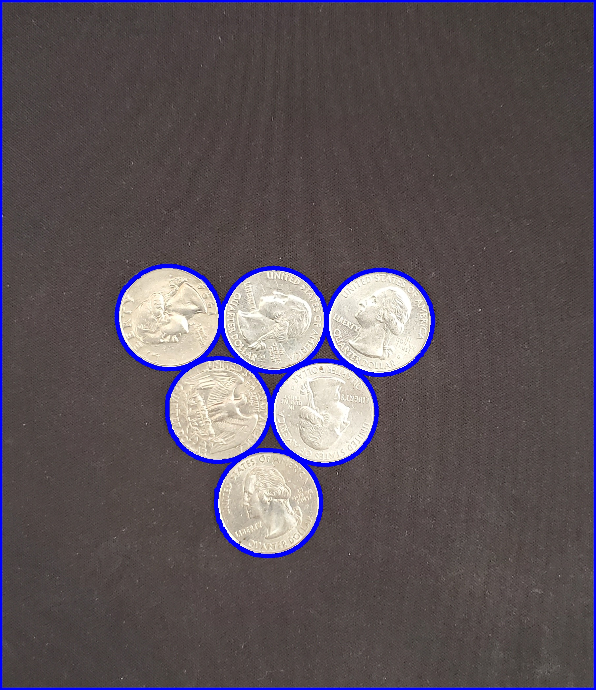
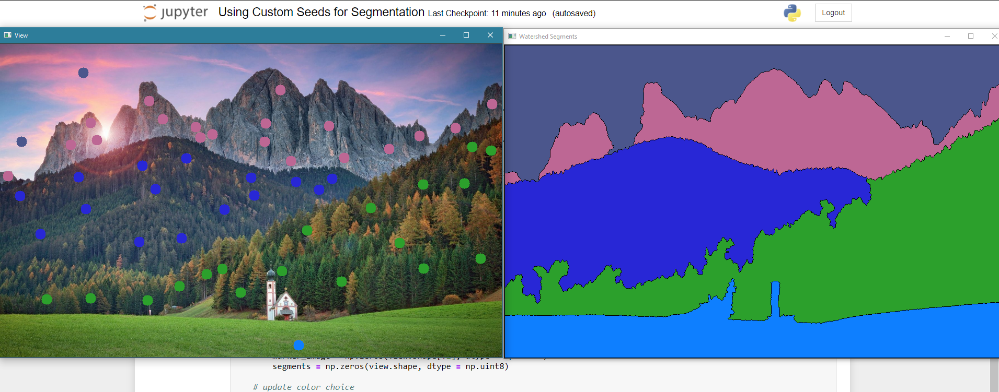

Watershed algorithm is a image processing tool which is especially useful in indentifying and separating joint objects in image foreground using distinct contours. While regular thresholding algorithms may be unabe to separate distinct objects in the foreground with lie close together, the watershed algorithm does this with ease. 

More info on how the algorithm works can be found at: https://en.wikipedia.org/wiki/Watershed_(image_processing)

The above program uses watershed algorithm to segment a picture of 6 coins placed together. Do explore the provided jupyter notebook for a detailed example.

This algorithm is commonly used to segment images with multiple foreground objects at different levels by using custom seeds: 

